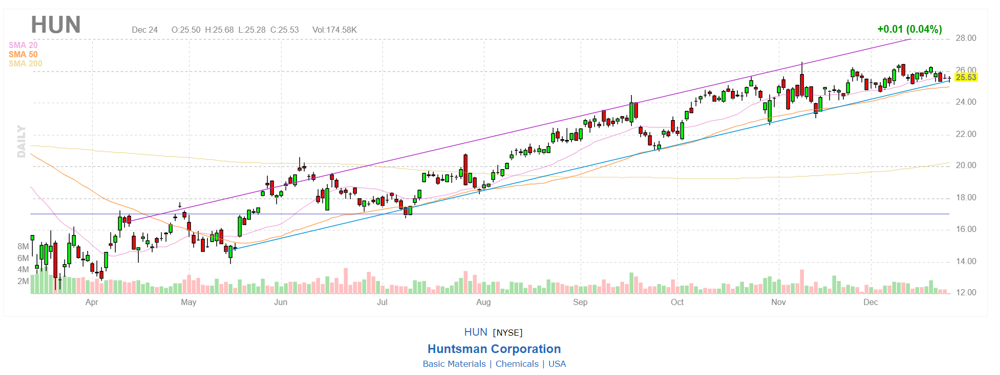

# Stock patterns

Name | Chart | Symbols | Description
---- | ----- | ----- | -----------
Tunnel |  | [HUN](https://finviz.com/quote.ashx?t=HUN&ty=c&p=d&b=1)
Overbought |  | [BBIO](https://finviz.com/quote.ashx?t=BBIO&ty=c&ta=1&p=d&b=1) | [Link](https://www.investopedia.com/terms/o/overbought.asp)
Multitop |  | [NEP](https://finviz.com/quote.ashx?t=NEP&ty=c&p=d&b=1)
Wedge Up |  | [INMD](https://finviz.com/quote.ashx?t=INMD&ty=c&p=d&b=1)| [Link](https://www.investopedia.com/terms/w/wedge.asp)
